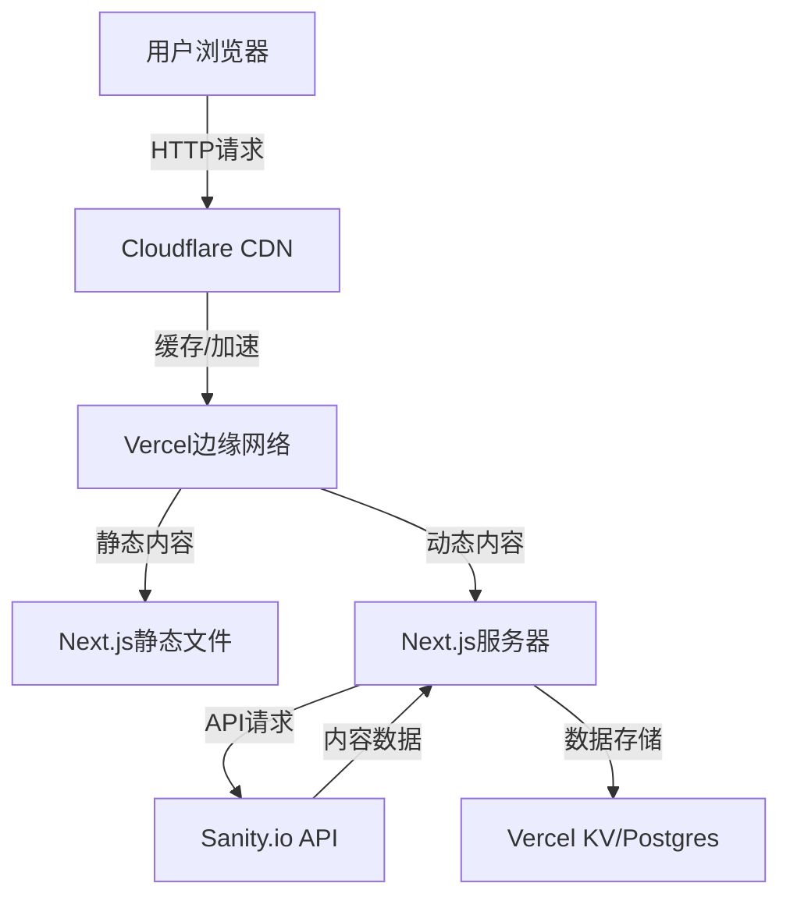

# Klearvoy 网站技术选型方案

## 1. 技术栈选择

### 1.1 核心技术栈
| 技术 | 版本 | 用途 |
|------|------|------|
| **Next.js** | 14+ | 前端框架，提供SSG/SSR能力 |
| **Tailwind CSS** | 4+ | 实用优先的CSS框架 |
| **Sanity.io** | 最新版 | Headless CMS内容管理 |
| **Vercel** | 最新版 | 部署平台 |

### 1.2 辅助技术
| 技术 | 版本 | 用途 |
|------|------|------|
| **TypeScript** | 5+ | 类型安全 |
| **Framer Motion** | 11+ | 动画效果 |
| **React Hook Form** | 7+ | 表单处理 |
| **i18next** | 23+ | 多语言支持 |
| **Cloudflare** | 最新版 | CDN和安全防护 |
| **Sentry** | 最新版 | 错误监控 |
| **Google Analytics 4** | 最新版 | 数据分析 |

## 2. 技术选型理由

### 2.1 Next.js 14
- **性能优势**：静态生成(SSG)和服务器端渲染(SSR)提供优异的加载速度
- **SEO友好**：服务器端渲染确保搜索引擎能正确索引内容
- **开发效率**：文件系统路由、API路由等特性简化开发
- **生态成熟**：丰富的插件和社区支持
- **边缘计算**：支持Edge Runtime，进一步提升性能

### 2.2 Tailwind CSS 4
- **实用优先**：基于工具类的CSS开发方式，减少CSS体积
- **响应式设计**：内置响应式工具类，适配不同设备尺寸
- **自定义能力**：通过配置文件定制主题和工具类
- **开发体验**：热重载和智能提示
- **性能优化**：自动移除未使用的CSS

### 2.3 Sanity.io
- **Headless架构**：内容与展示分离，灵活性高
- **实时预览**：内容编辑时可实时查看效果
- **结构化内容**：支持复杂的内容模型定义
- **协作能力**：支持团队协作编辑
- **API灵活**：提供GraphQL和REST API

### 2.4 Vercel
- **Next.js官方推荐**：与Next.js深度集成，优化部署
- **全球CDN**：提供快速的内容分发
- **自动部署**：与GitHub集成，代码提交自动部署
- **环境变量管理**：安全管理敏感配置
- **预览环境**：每个PR自动创建预览环境

## 3. 架构设计

### 3.1 系统架构


### 3.2 目录结构
```
├── app/                     # Next.js App Router
│   ├── layout.tsx           # 根布局
│   ├── page.tsx             # 首页
│   ├── about/               # 关于我们
│   ├── products/            # 产品中心
│   ├── cases/               # 案例展示
│   ├── news/                # 新闻中心
│   ├── contact/             # 联系我们
│   └── download/            # 下载中心
├── components/              # 可复用组件
│   ├── ui/                  # UI组件
│   ├── layout/              # 布局组件
│   └── sections/            # 页面区块
├── lib/                     # 工具函数
│   ├── sanity.ts            # Sanity客户端
│   └── utils.ts             # 通用工具
├── public/                  # 静态资源
│   ├── images/              # 图片
│   └── downloads/           # 下载文件
├── sanity/                  # Sanity配置
│   ├── schemas/             # 内容模型
│   └── studio/              # Sanity Studio
├── styles/                  # 全局样式
│   └── globals.css          # 全局CSS
├── next.config.js           # Next.js配置
├── tailwind.config.js       # Tailwind配置
├── tsconfig.json            # TypeScript配置
└── package.json             # 项目依赖
```

## 4. 核心功能实现方案

### 4.1 响应式导航
- 使用Next.js的App Router实现路由
- 采用Tailwind CSS的响应式类实现移动端适配
- 实现移动端汉堡菜单和桌面端下拉菜单
- 添加滚动时的导航栏样式变化

### 4.2 产品管理
- 在Sanity中定义产品内容模型
- 实现产品分类和筛选功能
- 使用Next.js的动态路由创建产品详情页
- 集成产品图片画廊和技术参数展示

### 4.3 联系表单
- 使用React Hook Form实现表单验证
- 集成邮件服务（SendGrid或Mailgun）
- 实现表单提交后的反馈机制
- 添加reCAPTCHA防止垃圾提交

### 4.4 多语言支持
- 使用i18next实现国际化
- 在Sanity中存储多语言内容
- 实现语言切换功能
- 支持URL中的语言前缀

### 4.5 性能优化
- 使用Next.js的Image组件优化图片
- 实现代码分割和懒加载
- 配置浏览器缓存策略
- 使用Vercel的边缘缓存

## 5. 部署与监控

### 5.1 部署流程
1. **代码提交**：推送到GitHub仓库
2. **CI/CD**：Vercel自动构建和部署
3. **环境配置**：通过Vercel管理环境变量
4. **域名配置**：在Vercel中绑定自定义域名
5. **SSL证书**：Vercel自动提供免费SSL证书

### 5.2 监控与分析
- **Sentry**：监控前端错误和性能
- **Google Analytics 4**：分析网站流量和用户行为
- **UptimeRobot**：监控网站可用性
- **Vercel Analytics**：查看部署和性能指标

## 6. 安全措施

### 6.1 前端安全
- **内容安全策略(CSP)**：防止XSS攻击
- **输入验证**：对用户输入进行验证
- **HTTPS强制**：全站使用HTTPS
- **依赖安全**：定期更新依赖包

### 6.2 后端安全
- **API认证**：保护敏感API
- **数据验证**：服务端数据验证
- **速率限制**：防止API滥用
- **安全头部**：设置适当的安全响应头

## 7. 开发工作流

### 7.1 本地开发
1. **环境搭建**：安装Node.js和npm
2. **项目初始化**：使用create-next-app创建项目
3. **依赖安装**：安装所需依赖
4. **Sanity配置**：设置Sanity项目和内容模型
5. **本地运行**：启动开发服务器

### 7.2 代码规范
- **ESLint**：代码质量检查
- **Prettier**：代码格式化
- **TypeScript**：类型检查
- **Git Hooks**：提交前检查

### 7.3 版本控制
- **Git Flow**：遵循Git Flow工作流
- **语义化版本**：使用语义化版本号
- **分支管理**：main、develop、feature分支

## 8. 技术风险与应对

### 8.1 潜在风险
- **学习曲线**：团队对新技术栈的适应
- **内容迁移**：现有内容向Sanity的迁移
- **性能优化**：确保在不同设备上的性能
- **SEO迁移**：确保迁移后SEO表现不下降

### 8.2 应对措施
- **培训计划**：为团队提供技术培训
- **迁移策略**：制定详细的内容迁移计划
- **性能测试**：定期进行性能测试和优化
- **SEO监控**：监控迁移前后的SEO指标

## 9. 未来扩展性

### 9.1 功能扩展
- **会员系统**：添加客户登录和账户管理
- **在线商城**：集成电商功能
- **API集成**：与ERP、CRM等系统集成
- **AI功能**：添加智能客服、产品推荐等

### 9.2 技术扩展
- **微服务架构**：将功能拆分为微服务
- **边缘计算**：利用Vercel Edge Functions
- **PWA支持**：添加渐进式Web应用功能
- **AMP支持**：为内容页面提供AMP版本

## 10. 结论

本技术选型方案基于Next.js 14 + Tailwind CSS 4 + Sanity.io + Vercel的技术栈，为Klearvoy网站提供了现代化、高性能、可维护的解决方案。该方案不仅满足当前静态网站的优化需求，也为未来的功能扩展和业务增长提供了坚实的技术基础。

通过此技术栈，Klearvoy网站将获得：
- **优异的性能**：快速的页面加载速度和响应时间
- **良好的SEO表现**：服务器端渲染和结构化数据
- **便捷的内容管理**：Sanity.io提供直观的内容编辑体验
- **可靠的部署**：Vercel的自动优化和全球CDN
- **可扩展的架构**：为未来功能扩展做好准备

此技术选型方案符合Klearvoy的业务需求和技术发展方向，是一个全面、实用的解决方案。